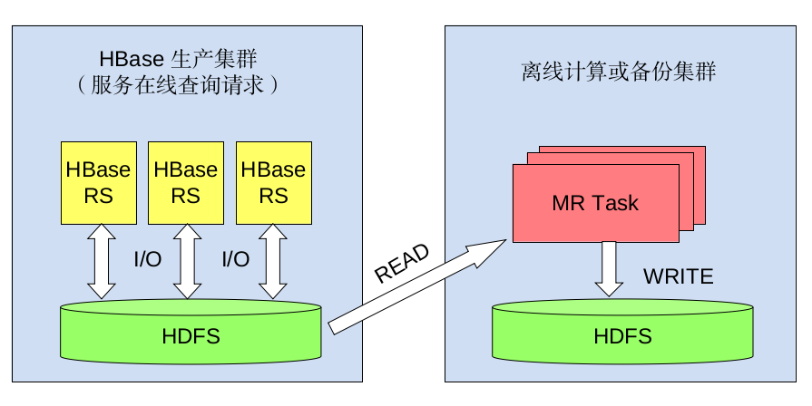

# HFileSync

本项目自动同步 HBase 的数据文件到离线集群，供后续 Hive/MR 处理。

用户需要指定同步的源目录和目录目录，源路径必须是 HBase 的数据根目录及表名，目标目录是任意的 HDFS 目录，推荐放在不同的集群上，以免后续离线处理时影响 HBase 读写性能。

## 架构



[介绍 PPT](docs/intro.ppt)


## 用法

    $ bin/hfilesync \
         --hbase-root=hdfs://nnobja.mars.grid.sina.com.cn:9000/hbase \
         --target=hdfs://nnobjaof.mars.grid.sina.com.cn:9000/tmp/shichao3/sync \
         --jobtracker=jtobjaof.mars.grid.sina.com.cn:9001 \
         --table=table1,table2

## 实现

同步一个 HBase 表时，我们维护「未同步区间」的列表。初始情况，未同步区间是全表。然后通过若干轮迭代，每一轮尝试同步这一列表中所有符合的数据，将成功的区间从这一列表中去除。最终，当未同步区间为空时，即完成一次完成的数据同步。

这里描述的所有同步的数据源皆为 HFile，留在 MemTable 中的数据不做同步。我们线上 HBase 集群会配置自动 flush，即超过一定时间就将 MemTable 中的数据写到 HFile 中，这一时间通常在一天以内。因此，忽略 MemTable 中的数据在大多数场景没有问题。

### 单次迭代中可能遇到的失败场景

处理同步失败是一个难点，有以下两种可能造成同步失败的场景。当部分区间同步失败后，在下一次迭代会继续同步这些区间。

#### 合并 (Compaction)

HBase 定期合并文件（compaction）回收空间。当发生合并时，RegionServer 将若干个 HFile 读出，多路归并，写下新的 HFile，然后删除旧的 HFile。如果直接使用 distcp 复制数据，发生删除时，有一定概率造成整个作业失败。HFileSync 会处理这种情况，当发生正在读的 HFile 被删除时，HFileSync 会重新扫描该分区的 HFile，重新进行同步。

#### 分裂 (Split)

当发生分裂时，例如 A 分区分裂为 B 和 C 分区。HFileSync 首先扫描分区列表，确定需要同步哪些分区。若扫描发生成分裂前，HFileSync 会同步 A 分区，若扫描发生在分裂后，HFileSync 会同步 A B C 三个分区。

## 使用示例

1. 通过 max_concurrent_copier 可以指定拷贝的最大并发数
2. 通过 skip_prefixes 可以跳过部分部分region (被skip_prefixes完全包含的, 部分包含不跳过)

```
./hfilesync-0.9/bin/hfilesync \
    --hbase-root=hdfs://nnobja.mars.grid.sina.com.cn:9000/hbase \
    --target=hdfs://nnobjaof.mars.grid.sina.com.cn:9000/tmp/20141120_wg_table_194 \
    --jobtracker=jtobjaof.mars.grid.sina.com.cn:9001 \
    --table=entity,wg_object_permissions \
    --max_concurrent_copier=6 \
    --skip_prefixes="entity,1042015:mblog_;entity,1022:;wg_object_permissions,1022" 
```

## 二进制包

[0.9](http://maven.intra.weibo.com/nexus/content/repositories/releases/com/weibo/inf/hfilesync-assembly/0.9/hfilesync-assembly-0.9.tar.gz) 

[0.8](http://maven.intra.weibo.com/nexus/content/repositories/releases/com/weibo/inf/hfilesync-assembly/0.8/hfilesync-assembly-0.8.tar.gz)

[0.4](http://10.75.3.131/nexus/content/repositories/releases/com/weibo/inf/hfilesync-assembly/0.4/hfilesync-assembly-0.4.tar.gz)
